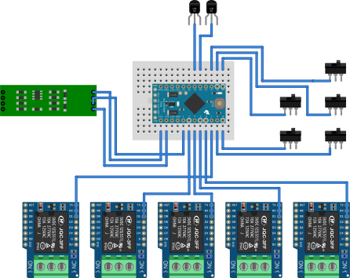

Arduino Modbus v1 контроллер
---------------------------------------

[Project site](https://e154.github.io/smart-home/) |
[Server](https://github.com/e154/smart-home/) |
[Configurator](https://github.com/e154/smart-home-configurator/) |
[Node](https://github.com/e154/smart-home-node/) |
[Development Tools](https://github.com/e154/smart-home-tools/) |
[Smart home Socket](https://github.com/e154/smart-home-socket/)

##### Функции
    Контроль температуры двух датчиков
    Включение/Выключения нагрузки (5 штук)
    Контроль состояния по линии
    Удаленное Включение/Выключения нагрузки

##### Общение с сервером
    Общение происходит по линии связи rs485, по протоколу MODBUS RTU
    
##### Список компонентов
    Любая плата Arduino (pro mini 5v)
    Плата с реле 5шт
    RS485 конвертер
    lm35 - 2шт датчика температуры
    5 выключателей 
   

        
##### компиляция из исходников

Установить platformio по инструкции:
https://docs.platformio.org/en/latest/installation.html#super-quick-mac-linux

инициализация проекта:

```bash
platformio init --ide clion
```

##### LICENSE

Smart home socket is licensed under the [MIT License (MIT)](https://github.com/e154/smart-home-modbus-ctrl-v1/blob/master/LICENSE).